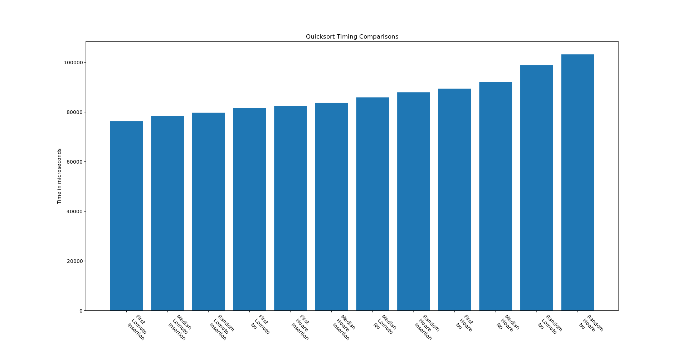

# Aglorithms 
## Assignment 1

Given the basic quicksort algorithm, a few improvements are capable of being made.

* Pivot Choice / Pre-processing
* Partition Scheme
* Insertion sort cutoff.

This version of quicksort uses a configuration and a basic wrapper to accomplish comparison of runtimes between the combinations of these improvements.

## Pivot Choice

Pivot choices considered are:
1. First Element &mdash; Uses the first element in the subarray for pivot value
2. Median-Of-3 &mdash; Uses the median of the first, last, and middle elements of the subarray for pivot value.
3. Random Element &mdash; Uses a random element from the subarray for pivot value. Chosen by a PRNG.

From these, First-Element worked best on my data. It may be that Median-Of-3 Pivoting works best when hard coded alognside a partition within the algorithm to take advantage of its preprocessing. 

Without using the advantage of the preprocessing, it seems the overhead is not worth the time cost.

## Partition Scheme

Two partition schemes were used:
1. [Lomuto ](https://en.wikipedia.org/wiki/Quicksort#Lomuto_partition_scheme)
2. [Hoare](https://en.wikipedia.org/wiki/Quicksort#Hoare_partition_scheme)

From these, Lomuto worked best on my data. Similar to the median-of-3 issue, hoare works better when taking advantage of the combination but has a small overhead otherwise.

## Insertion cutoff

Insertion cutoff was used in half the samples. This was done by cutting off quicksort if 10 or less elements and insert sorting the array after the quicksort finishes. 

Insertion sorting cutoff schemes tended to run a small time faster.

## Data
Here are the different sorting schemes (cartesian product combinations of above choices) and the sorting times from 10,000 to 1,000,000 elements.

Times are the average of a system clock for 100 different arrays. the array contents were repeated for each experiment but different between each other.

Here are the comparison of average times for each of the 12 sort configurations for 1,000,000elements.

The fastest and configuration values can be found in the repo for sizes ranging from 1,000 to 1,000,000.
