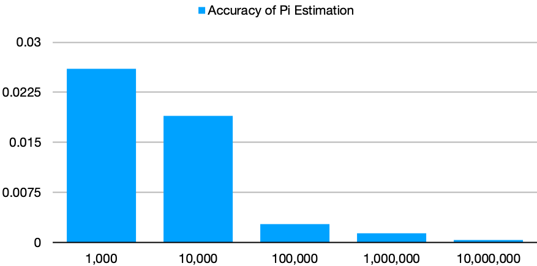

# Aglorithms 
## Assignment 3

1. Computing Π (Pi) probablistically

In order to find Pi probabilistically, random numbers were sampled from (x, y) 
coordinates within in a square of width of 2 and centered about the origin.
The hypothenuse was then used to calculate the distance from the origin to the
coordinate. Because the circle of radius 1 centered at the origin is enclosed
within the sampling square, it is possible to compute the ratio of sampled
points that lie in both the square and circle to the total number of samples.
Given the area of the square is 4 and the circle is Pi, the ratio of samples
inside the circle should approach Pi/4. As represented in the graph below, the
delta or absolute difference from the actual value of Pi and the calculated
value, decreases as the value of samples increases. Because the data is pseudo-
random, these results see a larger difference in accuracy after a sufficient 
number of samples. In this case the threshold is around 100,000. After the 
threshold of 100,000 the increase in the sample size has a nearly negligible
effect on increasing accuracy.

2. Testing for Prime Numbers

An integer, P, can be tested to be probably prime by checking its congruence to 
several base integers. This is done by seeing if P (mod n) is congruent to 0
for several natural numbers where 1 < n < P. By picking more tests the accuracy
of saying it is prime increases. Note, if a number is found to be composite, it
is done so detirministically. That is, all output of the test as COMPISITE is 
always correct. Only False negatives can occur (saying a number is prime when 
it isn't). This testing can be extended to include Fermat's little theorem,
[here](https://en.wikipedia.org/wiki/Fermat%27s_little_theorem)
and also the works of Miller and Rabin concerning pprimality testing found
[here](https://en.wikipedia.org/wiki/Miller%E2%80%93Rabin_primality_test)
The idea is that fewer numbers can be tested while still resulting in the same
or better probably accuracy of primes. This is done through different ideas 
than that of factoring. Rather, modular exponentiation is used.

3. Searching an Array

4. Monte Carlo Integration

5. 8 queens problem

